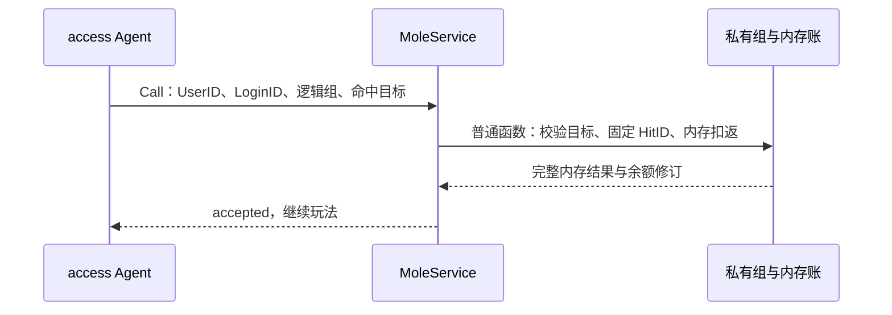
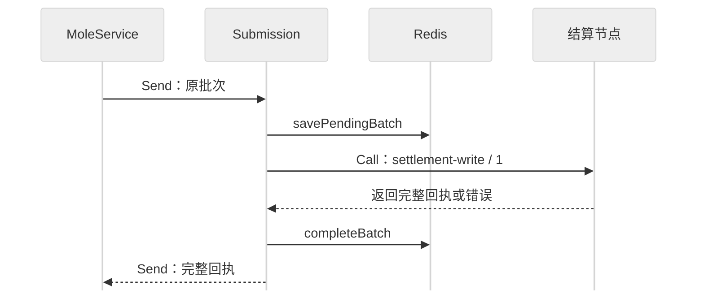

# GSR Demo 系统设计

本文描述当前代码已经实现的职责、调用链、数据归属和故障边界，不记录开发过程、提交历史或逐轮测试成绩。未实现及待确认的工作统一放在[最后一节](#10-后续工作)。协议字段见 [PROTOCOL.md](PROTOCOL.md)，运行与验证命令见 [README.md](../README.md)，编码规则见 [GO-CODE-STYLE.md](GO-CODE-STYLE.md)。

## 1. 系统范围与节点职责

Demo 包含持续运行的多人打地鼠和三人随机房斗地主，使用示例银子。用户只连接 access；账号认证、在线位置、游戏状态和权威账务分别由对应节点管理。

| 节点 | 当前职责 | 主要状态或存储 |
| --- | --- | --- |
| access | MAC WebSocket 接入、每连接 Agent、Token 登录、游戏协议转发与推送 | 当前 UserID/LoginID、连接地址、各游戏路由；无权威钱包或玩法状态 |
| login | 密码认证、平台 AccessToken 的签发/校验/撤销 | MySQL 账号；Redis Token 摘要、UserID 和过期时间 |
| online | Bind/Lookup/Unbind 在线位置目录 | 内存 `UserID → LoginID / AccessNode / AgentName` |
| mole | 分组、共享地鼠、即时内存记账、批量提交及余额校正 | 组状态和余额投影；Redis 源批次与确认统计 |
| landlord | 凑桌、叫抢出牌、局末三人结算与待请求恢复 | 本桌内存状态；Redis 待结算请求 |
| settlement | 通用银子变更、事务、幂等和查询 | MySQL 钱包、操作索引、批次明细与回执 |

当前部署模板为两个 access 实例和其余各一个节点。两个游戏共享 settlement，路由显式配置；Online 不保存房间位置，游戏热点操作不逐次经过 Online。节点之间不导入对方实现，按服务名、命令和参数契约通信。

## 2. 工程与运行模型

### 2.1 GSR 与参考边界

- 各节点使用独立 Go module，固定 `github.com/cnooljaw/gsr v1.0.4`；源码位于节点根目录。`common` 提供共享配置、生成的 RPC 契约及对应生成工具，`typeclient` 是独立 TypeScript 项目；本地 replace 仅指向本仓库 common。
- 节点由 `gsr.Run + MainService` 启动。MainService 创建、命名 Service 并打开 Cluster，组装完成后退出；已创建的 Service 和监听继续运行。外部 MySQL/Redis 客户端由宿主创建，Run 返回后关闭。
- 每份可变状态归一个 Service，普通组件由其 owner 串行调用。独立 Service 提供独立 Mailbox 和等待边界；组件拆分不提供并行能力。业务使用 GSR `Call/Send/After`，不保存回调上下文或启动业务 goroutine。
- 客户端使用 Protobuf Registry/Envelope，Cluster 使用 GSR 的规范 Go 参数。节点地址集中在 [nodes.yaml](../configs/nodes.yaml)，实例 YAML 通过 `nodes_file` 引用；相对路径基于配置文件目录。
- GSR 接入依据为 v1.0.4 的[开发指南](https://github.com/cnooljaw/gsr/blob/v1.0.4/docs/guides/APPLICATION.md)、[Cluster 教程](https://github.com/cnooljaw/gsr/blob/v1.0.4/docs/guides/CLUSTER.md)及 ADR [0012](https://github.com/cnooljaw/gsr/blob/v1.0.4/docs/adr/0012-node-capabilities-and-service-logging.md)、[0013](https://github.com/cnooljaw/gsr/blob/v1.0.4/docs/adr/0013-client-protocol-boundaries.md)。

GSR、nbgameserver、ServerLogic/hlddz 和 GoServerActorFsm 的相邻仓库只读。斗地主的普通牌型与叫抢流程参考 nbgameserver/gameofhlddz、ServerLogic/hlddz；地鼠分组与时间线参考 GoServerActorFsm。参考实现不构成兼容目标，也不引入 C/Lua 运行依赖；修改边界见 [AGENTS.md](../AGENTS.md)。

### 2.2 身份与操作标识

| 标识 | 含义与作用域 |
| --- | --- |
| UserID | MySQL 账号的稳定身份；与钱包主键对应 |
| AccessToken | 认证后签发的平台凭据，用于建立登录，不代表某条在线连接 |
| LoginID | 每次成功登录生成的随机身份，用于隔离旧连接、旧操作和迟到解绑 |
| AccessNode + AgentName | 跨节点推送地址；不使用临时 ServiceID 作为远程业务地址 |
| Membership | 斗地主成员实例，隔离离开后重进的迟到清理；地鼠成员与账务由同一 owner 修改，不使用此字段 |
| ActionID / Turn | 地鼠客户端请求身份 / 斗地主轮次，用于检查重复或迟到操作 |
| OperationID / BatchID | 财务原子操作身份 / 结算请求批次身份，重试不得改 ID 或内容 |

### 2.3 Service 契约与寻址

节点的业务命令定义在对应 Service 文件或附近。公开 Service 按整块命令生成共享契约，私有 Service 只保留节点内定义；节点内部优先使用源常量，跨节点引用 `common/rpc/<service>`。维护规则与生成入口见 [Service 命令与共享契约](GO-CODE-STYLE.md#331-service-命令与共享契约)。

| 节点 | 公开契约包 | 寻址方式 |
| --- | --- | --- |
| login | `auth`、`token` | 固定名称 `auth`、`token` |
| online | `online` | 固定名称 `online` |
| settlement | `settlementwrite`、`settlementread` | 固定池名 `settlement-write`、`settlement-read`，成员由 GSR 选择 |
| access | `accessagent` | 登录位置中的动态 AgentName |
| mole | `mole`、`moleentry` | 均为固定入口；AttackName 是逻辑组标识，不是 ServiceName |
| landlord | `landlord`、`landlordattack` | 固定目录名称 `landlord`，动态牌桌使用目录返回的 RoomName |

固定入口生成 `ServiceName`，动态实例只生成命令，不生成实例名或 ServiceID。业务节点地址从配置或已验证的位置记录取得，池成员数只影响节点组装。公开标记不代替 Handler 的来源、身份和参数校验。

新增游戏从职责确认、命令定义与生成，到同包组件接入和实际验证的顺序，见 [新增游戏的接入顺序](GO-CODE-STYLE.md#332-新增游戏的接入顺序)。

## 3. 接入、认证与登录

### 3.1 连接与协议入口

[access MainService](../nodes/access/main_service.go) 打开 Cluster 并创建 `SecurityModeMAC` Gate。Gate 拥有连接和 I/O，每条连接创建一个 [Agent](../nodes/access/agent.go)。当前模板监听本机 WS；MAC 提供传输认证，不提供加密。

一条连接使用一个 protocolDispatcher 和一个 commandDispatcher：客户端帧进入 `HandleClientMessage`，内部命令进入显式 `Handle`。Agent 只保存会话身份、连接能力和组件路由，不保存手牌、地鼠目标或权威余额。连接与出站队列上限由 access YAML 配置。

客户端协议集中在 [game.proto](../nodes/access/proto/demo/v1/game.proto)，由现有 `generate access` 入口生成 Go/TS 产物。客户端 MsgID 和内部 CommandID 是两个编号空间；注册与冲突检查见[编码规范](GO-CODE-STYLE.md#33-消息注册与分发)。

### 3.2 密码认证与 Token 登录

认证和登录是两个独立步骤：

1. `PasswordAuth`：Agent 调用 `login/auth`。AuthService 查询 MySQL 账号、验证密码，再本地 Call TokenService 签发凭据，返回 UserID、AccessToken、过期时间；此时不填写 Agent 登录身份，也不绑定 Online。
2. `Login`：Agent 调用 `login/token` 校验平台 Token，生成新 LoginID，向 Online 绑定服务端填写的连接地址。成功后保存会话身份；若替换了旧位置，Send 通知旧 Agent 按原 LoginID 退出。

[AuthService](../nodes/login/authservice.go) 和 [TokenService](../nodes/login/tokenservice.go) 使用独立 Mailbox，调用方向仅为 Auth → Token，密码 SQL 等待不会占用 TokenService。账号由 `-create-user` 管理入口显式创建；当前示例使用无盐 SHA-256 密码摘要。

[Token 存储](../nodes/login/token_redis.go) 使用 32 字节安全随机数并作 Base64URL 编码。Redis key 包含 Token 的 SHA-256 摘要，value 只保存 UserID 和过期时间，记录与 TTL 原子写入；不保存明文 Token 或内存凭据副本。默认有效期 24 小时，可配置 1 秒至 7 天；校验不续期。

重复认证可以产生多个有效 Token。普通断线不撤销 Token；显式 Revoke 只影响后续登录，不代替踢线。已登录连接不逐消息访问 Redis，也不会在 Token 过期时自动退出。Redis 不可用时拒绝新认证凭据或新 Token 登录；Redis 数据丢失后需要重新认证。

### 3.3 失败、替换与断线

- 一条连接只允许成功登录一次。客户端的 UserID、LoginID 和后端路由由服务端决定，游戏入口要求已经登录。
- [clientErrorPolicy](../nodes/access/agent_failure.go) 通过 `protocol.WithErrorPolicy` 在 Agent 组装时注册。未响应的认证/登录失败、未知进入和非法后端回包先设置 `closing`，选择 `ReplyErrorAndClose`；Dispatcher 只编码一次安全 ErrorResponse，保留原 RequestID，交给 Gate `SendAndClose`。普通业务拒绝仍选择 `ReplyError`，业务 Handler 继续返回原错误。
- 进入流程通过保留原错误的私有标记交给错误策略，不在 Agent 中硬编码各游戏的进入 MsgID。超时、取消、链路故障及未分类 Handler 失败不能证明未加入；业务明确拒绝、邮箱满和明确未接纳/目标消失仍返回原错误，不触发此关闭规则。斗地主 Join 结果未知时保留已知房间，断线按当前 UserID、LoginID 尽力 Leave；地鼠无论是否收到逻辑组名，都按 UserID、LoginID 向固定 MoleService 尽力 Leave，再条件 Unbind；仍不承诺撤销尚在途的入场，残留由后续显式登录/进入覆盖。两者都不自动重试或宣称已回滚。
- `HandleClientMessage` 在 closing 时丢弃已入邮箱的后续客户端请求，必要清理 Command 仍正常处理。选择关闭后不立即 Exit/Close，等待原 `ClientDisconnectedCommand`，尽力 Leave、条件 Unbind 后退出；OnStop 幂等 Close。清理失败不代表后端未加入。
- Gate 沿用默认一秒总预算，覆盖当前写入、旧队列、末帧和关闭；写完立即关闭，接纳失败/写失败/超时仍有界关闭。SendAndClose 的 nil 只表示接纳，不保证客户端送达；无可靠 RequestID、已知 Notify 或错误编码失败只关闭，不伪造响应。请求已成功响应后的错误、Handler panic 不保证经过错误策略。正式边界见 GSR [发送后关闭指南](https://github.com/cnooljaw/gsr/blob/v1.0.4/docs/guides/SEND-AND-CLOSE.md)。
- Bind 失败或超时不开放游戏，不自动重发 Bind；按候选 LoginID 尽力清理。Bind 可能已替换旧位置，清理不会恢复旧绑定，旧连接也可能尚未收到替换通知；需要后续显式登录重建位置，不能重放旧 Bind 覆盖较新登录。普通断线依次调用游戏组件 Disconnect，再条件 Unbind，清空身份；OnStop 关闭连接。
- 进程骤停不能执行清理，Online 或游戏目录可能暂留旧位置，由后续显式登录/进入覆盖。旧 LoginID 的替换通知、操作和解绑不能作用于新登录。

实现入口：[agent_login.go](../nodes/access/agent_login.go)、[agentSession](../nodes/access/agentsession.go)。

### 3.4 多游戏组合与客户端行为

Agent 通过唯一 `games` 清单组装 [comMole](../nodes/access/commole.go) 和 [comLandlord](../nodes/access/comlandlord.go) 组件。组件与 Agent 同属 access 根目录的 `package main`，通过文件和类型组织职责；组件实现 `Name / ProtocolHandlers / CommandHandlers / Entered / Disconnect`，从同一清单完成注册、进入互斥和断线清理。一个连接不能同时进入两种游戏，`Entered` 从路由推导，不另存 activeGame。Join 已返回但客户端回包校验失败时，仍保留已知路由供断线清理；持有路由不表示客户端已收到进入成功。回包校验与离开确认见[游戏 RPC 契约](PROTOCOL.md#24-mole进入与组内操作)。

组件通过 [componentDependencies](../nodes/access/component.go) 读取当前身份快照、请求进入准入、有界 Call 和客户端 Push；不持有父 Agent 或保存 self。[组装器](../nodes/access/agent_handlers.go) 拒绝空白/重复游戏名、重复编号及占用 Gate 断线命令。推送直接绑定具体方法：地鼠快照 100、余额校正 102、斗地主座位、准备、发牌、叫抢、出牌、结算、托管及轮次开放事件 111～118；101 用于旧登录替换，不使用 kind 字符串二次分发。

这些业务命令同属一个 Agent Service，统一在 [agent.go](../nodes/access/agent.go) 定义；Agent 与游戏组件直接引用同包源常量，远端节点引用生成的 `accessagent` 契约。Agent 名称由连接启动时生成，契约不包含固定 ServiceName。Gate 断线事件使用框架命令。

TypeScript CLI 完成密码认证再 Token 登录，也可显式保存 0600 Token 文件，后续直接 Token 登录。银子和身份使用 bigint；地鼠按绝对余额与 revision 接受更新。只有明确的 `target_unavailable` 拒绝会触发重新选目标；超时、繁忙、断线等未知结果停止操作并保留 ActionID，不自动重发命中。地鼠客户端收到 accepted 即继续玩法，斗地主按事件更新场景、等待结算事件；两者都不追加逐笔查账。

## 4. Online 位置目录

单个 [OnlineService](../nodes/online/onlineservice.go) 独占内存 map，只保存当前 UserID 对应的 LoginID、AccessNode 和 AgentName，不访问数据库或同步调用其他节点。

- **Bind**：新 LoginID 替换当前位置并返回旧位置；当前 LoginID 的相同地址重复提交返回 nil，不把自身作为待踢连接；相同 LoginID 的不同地址报冲突。
- **Lookup**：返回当前独立位置快照，无记录返回 nil。
- **Unbind**：只有 LoginID 匹配才删除，旧连接迟到清理返回 false。

Online 不保存额外在线布尔值、房间状态、历史或墓碑。重启目录为空，需要显式重新登录建立绑定；已进入游戏的命中和出牌直接访问房间，不依赖持续 Lookup。

## 5. 地鼠：即时玩法与后台入账

### 5.1 规则与状态归属

一个组最多 3 人、9 个洞，有人即可玩、空位可补、随时退出，没有固定局长。每秒生成一个目标，有效 2 秒；每锤扣 100，返 0 或 198 的概率各为 50%，规则版本 `demo-99-v1`，期望返还为 99%。目标是否可命中以服务端截止时间为准，Timer 迟到不延长有效期。

| Service / 私有组件 | 独占状态与职责 |
| --- | --- |
| MoleEntryService（`mole-entry`） | 核对 Online 身份，协调完整 Enter；仅在缺余额时查询结算读池，不持有成员或补偿状态 |
| MoleService（`mole`） | 唯一内存状态 owner：组、成员、用户到组的索引、刷新顺序、内存余额与待扣、归批缓冲、在途批次及确认统计 |
| moleGroup / attackGame | MoleService 私有对象：每组三人座位、当前连接、目标与有限请求记录；无独立邮箱或生命周期 |
| moleAccounting | MoleService 私有组件：确认余额/版本、待确认扣返、显示修订号、幂等记录和归批规则；不拥有成员归属 |
| MoleSubmissionService（`mole-submission`） | 独占 Redis 检查点、原批次及回执，负责持久化、结算 Call、恢复和重试 |

Entry 和 MoleService 为公开固定入口，契约分别生成到 `moleentry`、`mole`；Submission、Pulse 为私有 Service。组名沿用协议字段 `attack_name`，只作为逻辑组标识随 Hit/Snapshot 参数传入，不注册动态 ServiceName。组、成员和账户都在同一 owner 内修改，不存在预留座位、缓存归属 Membership 或入场补偿队列。

组装见 [MainService](../nodes/mole/main_service.go)，组对象见 [moleGroup](../nodes/mole/molegroup.go)，规则见 [attackGame](../nodes/mole/attackgame.go)，内存账见 [moleAccounting](../nodes/mole/moleaccounting.go)。统计池累计唯一已入账的锤数、扣除、返还与净留存，不计等待或拒绝操作，不影响概率，也不是可支出钱包。

### 5.2 进入与即时命中

Agent Call 固定 `mole-entry`；Entry 核对 Online 当前绑定，再本地 Call `mole / 1` Enter。MoleService 先检查所有可拒绝条件，已有账户直接使用当前内存账；缺账户且无余额种子时返回 `mole.balance_required`，不建立组、成员或账户。Entry 仅对此错误查询 `settlement-read / 4`，再携确认余额重试一次 Enter；查询失败无需清理中间状态。

Enter 在同一回调内完成选组、入座、缺失账户初始化和快照生成，中途不等待消息、Redis 或 SQL。已有账户始终忽略外部余额种子，不能覆盖待确认扣返。MoleService 按实际人数维护一人组、两人组两个可补位集合，入场先补两人组、再补一人组，同人数任选；满组不参与选组。入座、离开时在同一回调更新这些派生索引，空组直接回收。每组最多三人；相同用户重进保留原组和座位，更新登录与接入位置。用户到组的索引与组内成员一起更新，只有实际成员占座。

Call 超时仍可能已经完整入座，不能宣称回滚；后续显式重进按用户索引回到原组。access 命中与快照均 Call 固定 `mole`，携带逻辑组标识并核对登录身份。Leave 只需 UserID、LoginID：旧登录不能移除新成员，不存在的成员幂等返回成功；移除成员、回收空组与判断账户释放在同一回调完成。断线清理不依赖已经收到组名，但仍是尽力操作，不保证撤销尚在途的 Enter。

即时命中不等待 Redis、MySQL 或其他 Service：


```mermaid
sequenceDiagram
    participant A as access Agent
    participant M as MoleService
    participant G as 私有组与内存账
    A->>M: Call：UserID、LoginID、逻辑组、命中目标
    M->>G: 普通函数：校验目标、固定 HitID、内存扣返
    G-->>M: 完整内存结果与余额修订
    M-->>A: accepted，继续玩法
```

组规则检查 ActionID、SpawnSeq、洞位、有效期及占用，生成 HitID 并固定抽奖一次；同目标只接纳一锤。相同身份和内容返回原记录，改目标或洞位报冲突。明确的内存拒绝释放仍有效的目标；跨节点 Call 结果未知不能换 ID 或重抽。规则记录与内存幂等记录均有上限，不承诺保存永久逐锤历史。

内存账按完整 Debit 检查可用额：显示余额 = 确认余额 + 所有待确认操作的净变化；可用额 = max（确认余额 − 所有待确认 Debit，0）。未确认奖励可显示，但不能支付下一锤。

### 5.3 批次提交与余额校正

MoleService 每 100ms 归批，达到数量或字节阈值时提前提交；每批最多 500 项、256KiB，全局最多 4,096 项待确认操作。只有一个在途批次，缓冲发送未接纳时保留操作，不撤销已经返回的内存奖励。

后台链路按原批次完成持久化、入账和交付：


```mermaid
%%{init: {"theme":"neutral","sequence":{"mirrorActors":false}}}%%
sequenceDiagram
    participant A as MoleService
    participant S as Submission
    participant R as Redis
    participant C as 结算节点
    A->>S: Send：原批次
    S->>R: savePendingBatch
    S->>C: Call：settlement-write / 1
    C-->>S: 返回完整回执或错误
    S->>R: completeBatch
    S-->>A: Send：完整回执
```

[Submission](../nodes/mole/molesubmissionservice.go) 的三个动作是 `restoreCheckpoint`、`submitBatch`、`completeBatch`。保存原批次成功后，Call 结算写池并直接校验返回的完整回执。等待仅占用 Submission，MoleService 继续处理各组命中。收到有效回执后，先更新 Redis 确认统计、序号并清除待批次，再通知 MoleService；Redis 确认或本地通知失败时保留内存回执，只重试完成与交付，不重复调用结算。恢复批次只交付已确认统计，完成初始化后才开放新记账。

MoleService 的 `handleSettlementReceipt → accounting.applyReceipt` 更新较新确认余额、释放本批待扣并保留后续操作，重算显示余额；不能把已入账扣款再减一次。确认基线降低而后续批次仍待确认时，显示余额最低为 0，后续待操作继续按原 ID 等待回执，不因显示封底而取消。显示有差异时经 `MoleService → 当前 Agent` 推送绝对余额校正，一致时不重复奖励。校正不复活目标、不修改已完成命中、不反向冲账。

### 5.4 检查点与故障边界

[Redis 检查点](../nodes/mole/molesubmissionservice_redis.go) 用一个版本 2 的值保存确认统计、最后序号/批次及至多一个 pending。Lua CAS 整体替换，不在 Lua 中计算金额；已完成的原批次重复处理不累计统计，跨批旧操作按 `origin_batch` 排除重复累计。检查点无 TTL，缺失时必须显式 `-init-accounting`，损坏或旧格式拒绝开放记账；不支持两个活跃 mole 共用同一个 key。

- 未保存 Redis 的内存命中可能在崩溃时丢失；已保存批次按原 ID、顺序和金额恢复，不查询后再抽奖或重新生成请求。
- Redis 等待最多 500ms；结算 Call 的总等待范围见[调用与超时](#72-调用与超时)。超时、满邮箱、临时错误或非法回执保留原请求，按 100ms～2s 退避重试，不逐笔查账。业务确定性错误，以及 GSR 的 `runtime.unknown_command`、`runtime.invalid_command_arguments` 接线错误，保留原批次并暂停新记账；修复后重启，按原请求恢复。
- Leave 不取消已接纳账务；用户已离开且没有待结算操作时直接删除账户，否则等回执完成再释放。实际成员和缓存账户各有 100,000 上限，每组请求记录上限 1,024，已完成记账记录上限 4,096。
- 私有 [molePulse](../nodes/mole/molepulse.go) 用 GSR After 每 100ms 唤醒 MoleService，Tick 先归批账务，再推进到期刷新，目标邮箱满只跳过本次，不切断后续周期。Submission 等待、超时和重试不占用内存玩法 owner。
- [刷新调度](../nodes/mole/molespawn.go) 使用 owner 私有 FIFO 队列：所有组周期固定为 1 秒，建组追加到尾部，刷新后按当前时间安排下一秒并移到尾部，因此只检查队首就能找到最早到期组；空组回收时一起移除。每批最多刷新 128 组，并在完成单组后检查 2ms 软预算；超过预算不抢占当前组。剩余到期工作由 GSR Send 给自身的 `Refresh / 12` 续批，最多一条在途；续批仅接受自身来源，消息排在已有请求之后。未接纳时不保留在途标记，由下次 Pulse 补做。刷新不追补错过的秒数，旧目标仍按原截止时间失效。
- Submission 退出暂停新记账；MoleService 退出使宿主返回失败。组是普通对象，不再有组间独立邮箱或 panic 隔离；MoleService 回调只做有界内存工作和非阻塞发送，不直接调用外部存储。当前单 owner 吞吐需要实测，不能直接用共享同一状态的 Service 池增加并行。

## 6. 斗地主：牌桌与局末结算

### 6.1 凑桌、规则与可见性

[LandlordService](../nodes/landlord/landlordservice.go) 只管理桌预留、人数和用户路由。目录按占位数维护可加入牌桌索引，人数包含有效预留；优先补两人桌、再补一人桌，空闲桌最后选择，同占位数任选。封桌、满桌不参与补位；预留、释放、封桌/解封和到期核对均在同一目录回调更新索引，删除桌时一起清理。客户端不指定桌号。每桌一个 [AttackService](../nodes/landlord/attackservice.go)，具名组合私有 `attackGame` 和 `roundSettlement`，由本桌串行修改，不增加规则 Service 或共享游戏基类。

目录和牌桌分别整体生成 `landlord`、`landlordattack` 契约，节点内协作仍引用源常量。恢复实例复用牌桌实现，但不注册远程名称；私有 `landlordPulse` 的计时命令不生成共享契约。牌桌 Tick 即使有共享编号，也继续拒绝远程来源。

Resolve 为本次进入生成 Membership，预留固定有效 30 秒；再次 Resolve 更新当前预留和期限，不重复增加人数。目录在每桌 `Pending` 中只存最多三份期限，真实成员仍由牌桌拥有。Join 核对 Online、当前 Membership 及期限，过期预留不能用于迟到 Join。

牌桌通过现有 Pulse 上报不含手牌的三人身份值快照，由目录执行 `ReconcileReservations / 6`：实际成员与当前预留一致时解除期限，Call 回执丢失不影响确认；到期且未入座时条件释放；新登录未完成且到期时恢复实际成员的原路由，保留原手牌和待结算身份。目录只检查该桌待预留，不扫描其他桌，不反向 Call 牌桌。恢复服务不参与进入预留核对。

[attackGame](../nodes/landlord/attackgame.go) 用一个 phase 表示 `waiting → calling → robbing → playing → finished`，规则如下：

1. 三人入座且全部准备后洗牌，每人 17 张，另留 3 张底牌；随机选择首叫者。发牌后等待 3 秒，再由服务器开放叫地主。首个叫地主者成为候选，不叫者本次不再参与抢地主；有资格玩家依次抢，有人抢后首叫者可最终抢回。无其他候选时可直接确定地主，跳过后续询问。
2. 三人都不叫最多重发两次；第三次仍不叫，清空手牌并回到 waiting，不产生资金变化。重发不重置 Turn。
3. 确定地主后公开底牌并加入地主手牌，由地主领出；首次领出和两家不出后的重新领出前等待 0.5 秒，再由服务器开放操作。叫/抢各 10 秒，超时默认否；出牌 20 秒，超时进入托管，随后领出最小单张或跟牌不出。两家不出后，上一出牌者重新领出。
4. 校验当前 LoginID、阶段、Turn、截止时间、持有的具体牌及牌型大小。普通牌型包括顺子、连对、飞机及带牌、四带二、炸弹和王炸等，见 [cards.go](../nodes/landlord/cards.go)。快照只返回本人手牌、他人余牌数及公开牌面；底牌在确定地主后才公开。
5. 玩家可开启或取消托管；托管叫抢在下一次 Tick 默认否，托管出牌至少等待 0.5 秒。托管中拒绝本人手动叫抢/出牌，取消后恢复未过期的原截止时间，已过期则重新计时。重发牌清除托管。所有时间由服务器判定，玩家操作与自动操作在同一牌桌串行执行。
6. 离开先脱离本连接，座位回收时机见[重试、清理与恢复](#63-重试清理与恢复)；进行中保留手牌并按超时继续。新登录 Join 更新路由、取得当前快照，旧登录不能操作新成员。

Ready 查询钱包通过后，在当前回调的局部 `attackGame` 值上更新准备状态；若三人已准备，则先洗牌并向目录 Send 封桌，再发牌、进入 calling，最后更新本桌状态。钱包调用、洗牌或封桌发送失败均保留原桌状态，调用方可重试；其余玩家已成功确认的 Ready 不受影响。封桌 Send 成功只表示消息已接纳；进入 calling 后再收到 Ready 返回 busy，不重复封桌或发牌。

### 6.2 银子规则与结算时机

底分为 10，初次叫地主不翻倍，每次抢地主、炸弹/王炸各翻倍。当前不计算春天、明牌、个人加倍或手续费。设统一倍率为 M：地主胜时地主 Credit=20M、两农民各 Debit=10M；地主负时反向。规则校验倍率和金额上限，三人净变化合计为零。

牌桌按业务动作发送座位、准备、发牌、叫抢、出牌、托管、轮次开放与结算事件；操作本人和其他玩家使用相同的事件路径。发牌和结算按玩家生成私有字段。每桌维护事件序号，场景快照携带当前序号；场景和涉及计时的事件携带服务器采样时间及对应时间点，客户端在缺口或等待超时时查询场景，详细字段与恢复约定见[斗地主协议](PROTOCOL.md#14-斗地主协议)。

准备时查询钱包，至少 20 银子才可准备；这是准入预判，不冻结账户。局末使用一个 SettleEqualGroup 原子结算：每位输家最多扣到 0，赢家均分实际扣款，余数按 UserID 从大到小分配；客户端显示回执中的实际扣返和确认余额。

确定胜负的当前回调先广播出牌事件，再按以下顺序执行：

```text
prepareOperation：固定本局 OperationID 与三人金额
  → submit：保存 Redis 待请求，Call settlement-write / 7
  → applyReceipt：校验返回的原 ID、实际扣返和三人余额，确认本桌财务终态
  → pushSettlement：向三人的当前连接发送各自结算事件
  → deletePendingSettlement：删除 Redis 待记录
```

[roundSettlement](../nodes/landlord/roundsettlement.go) 用 `operation *landlordOperation` 保存固定请求及确认结果，`snapshotFor` 组装本人实际扣返、状态、余额与版本；pending 的实际扣返为 0；[landlordJournal](../nodes/landlord/landlordjournal.go) 只持久化请求字段。最后一手先发起出牌事件，在同一回调尝试保存并 Call 结算，然后返回出牌成功确认；取得合法回执后发送各自结算事件，不伪造 pending 的财务结果。保存或结算暂时失败不撤销已接受的出牌，主动查询场景仍可能看到未确认状态。最后一手的响应时间包含这次结算等待，外层超时时结果可能未知。

### 6.3 重试、清理与恢复

- 本桌直接 Call 写池，等待只占用本桌，其他桌继续工作。保存/删除 Redis 各等待最多 250ms；access 的外层 Call 等待 3 秒，包含本桌排队及处理时间。结算 Call 的总等待范围见[调用与超时](#72-调用与超时)。
- 超时、满邮箱、临时 Redis/远端错误或坏回执保留原请求，从本次等待结束后至少退避 1 秒再重提。原始 OperationID 和金额不变，Call 超时不表示未入账；保存失败时不调用结算。
- 保存时请求无效或同 ID 内容冲突、Call 返回非临时 Domain 错误，或命令不存在/参数不匹配时，设置本桌 `fault` 停止自动提交，保留内存原请求及已有 Redis 记录，不覆盖冲突记录、不伪造财务终态。先核查并修复问题；已保存请求可在重启时按原 ID 恢复，仅存在内存中的请求不能靠 Redis 恢复。坏回执只代表结果未确认，不进入此暂停分支。
- 有效回执只确认当前操作的完整终态，确认后不重复调用结算。发起推送后就清理 Redis，不等待客户端确认收到；推送失败不撤销入账。删除失败只保留清理标记，从本次等待结束后至少退避 1 秒再清理；等待期间的 Tick 不访问 Redis，也不重新调用结算。
- Leave 的 true 表示本桌已接纳离开：先清推送地址，waiting 时同时取消 Ready；目录回收可能尚未完成。进行中或仍有待确认结算时保留三人身份；waiting 或结算已确认时，通过本地 Call 请求目录释放成员，确认无同桌新预留后才移除座位。释放失败不撤销已接纳的离开，保留原 LoginID/Membership 供后续回收，不覆盖新成员。
- Pulse 或 Join 回收时，每实际移除一名成员即向剩余在线玩家发送离座事件；部分成功后失败仍保留已完成事件及原错误。未移除成员、新预留阻止回收、空转 Tick 或纯 Redis 清理不额外发送离座事件。Send 接纳不保证送达，客户端可恢复场景。
- 每桌私有 [landlordPulse](../nodes/landlord/landlordpulse.go) 通过 GSR After 每 250ms 唤醒本桌，处理超时、重提和清理。目录释放每次最多等待 1 秒，失败后用 `releaseRetryAt` 从等待结束至少退避 1 秒再补做；已离开状态由空推送地址判断。waiting 的 Join 会立即核对待回收座位，不受后台退避阻挡，避免目录已放位而桌仍占满。
- 预留核对最多等待 1 秒，无论成功或失败，均用 `reservationCheckAt` 从本次等待结束至少间隔 1 秒再检查；目录不可用时保留原状态。即使无人入座，牌桌仍继续核对；只有目录确认没有成员或有效预留、桌内无人且无待结算/Redis 清理任务时才退出。最后一个实际成员离开也沿用此边界，空桌不会提前终止其他人的有效预留。
- 启动时加载 Redis 待请求，为各请求创建恢复专用 AttackService；不发布可加入桌名，也不向旧连接广播，确认并清理后退出。只恢复已保存的局末账务，不恢复进行中手牌。清理前崩溃会再次按原 ID 幂等补交。

## 7. Settlement：并行执行与权威账务

### 7.1 入口与执行边界

[MainService](../nodes/settlement/main_service.go) 用 `CreateServicePool` 创建写、读两个池，再开放 Cluster；组装完成后退出，业务 Service 继续运行。

| 入口 | 调用方式与用途 |
| --- | --- |
| `settlement-write` | Call 写入，直接返回回执或错误；地鼠按批次提交，斗地主每局提交一笔三人操作 |
| `settlement-read` | 独立读池；Call 查询钱包、批次或参与者操作；游戏准入及受控核查使用，不逐锤、逐局追加查账 |

**池化的作用是让多个独立 Service 同时处理不同结算请求。** 每个 [settlementWriteService](../nodes/settlement/settlementwriteservice.go) 仍串行执行自己的邮箱；某个写或读成员等待慢 SQL 时，其他成员可以继续处理。调用方始终 Call 同一个池名，不需要自行分配执行者或接收异步回调。单个调用方连续同步 Call 仍是逐笔等待，不会因为目标池化就自动并发。

默认写池 12 个成员、读池 2 个成员、共享最多 10 个 MySQL 连接、每成员邮箱容量 64，见 [settlement YAML](../configs/settlement-01.yaml)。成员共享宿主创建和关闭的 `sql.DB`，每次结算独立开启事务，不缓存钱包。[settlementReadService](../nodes/settlement/settlementreadservice.go) 同样由多个独立成员执行，慢查询不阻塞其他读成员；读写仍受共享连接池和数据库能力限制；增加成员数不保证更快。

写、读成员分别只注册各自命令，池名由 MainService 统一注册。GSR 在对应池内轮询选择一次成员，选中邮箱满返回 `ErrMailboxFull`，不扫描其他成员。池不保证跨成员顺序；同一钱包由行锁和幂等记录保护，业务顺序由调用方维护。成员退出后不自动重建。mole、landlord 通过 `settlement_node` 选择结算节点；access 不直接调用结算，无此配置。多结算节点共用权威库，不自动发现或切换。

写、读命令分别在对应 Service 源文件维护并生成两份共享契约。调用方引用池的逻辑名称和命令，不感知池成员数量或 ID；契约维护规则见 [Service 命令与共享契约](GO-CODE-STYLE.md#331-service-命令与共享契约)。

### 7.2 调用与超时

接口编号、参数和回执见 [PROTOCOL：通用银子结算接口](PROTOCOL.md#26-通用银子结算接口)。写入路径统一为：

```text
Cluster.Call → GSR 选择池成员 → 邮箱排队
  → Handler 校验请求 → MySQL 事务 → 返回完整回执
```

| 计时器 | 当前时长 | 计时范围 |
| --- | --- | --- |
| 地鼠 Submission 的结算 Call | 3 秒 | 从发起 Call 到收到结果，包含网络、结算邮箱排队、SQL 和回传 |
| 斗地主本桌的结算 Call | 2 秒 | 同上；等待只占用本桌 |
| 结算服 SQL context | 2 秒 | Handler 校验后、进入事务前开始，覆盖获取数据库连接、SQL 与提交，不包含此前邮箱排队 |

**SQL 耗时包含在 Call 总等待时间里，两个超时不相加。** 但 SQL 使用独立的 `context.Background()` 创建超时，不继承调用方剩余时间。例如先排队 1.5 秒、再执行 SQL 2 秒，地鼠调用方在第 3 秒超时，结算服仍可能继续并提交成功。斗地主 Call 与 SQL 都为 2 秒，也可能因排队、网络和回传耗时而先超时。

Call 等待会占用当前调用方 Service：地鼠由独立 Submission 等待，MoleService 继续处理命中；斗地主由本桌等待，其他桌继续运行。结果未知时，游戏保留 Redis 待请求，按原 ID 和内容退避重试；拿到有效回执后完成交付与清理，不再调用结算。各游戏的具体处理见第 5、6 节。

### 7.3 事务与幂等

结算服只按非负 Debit/Credit 校验并入账，不判断概率、牌型或输赢；业务明细随请求保存，地鼠统计池归 mole。

[事务实现](../nodes/settlement/settlementstore.go) 为每批开启一个 MySQL 事务：

1. 核对已有 BatchID、OperationID；同 ID 同内容复用原结果，不同内容报冲突。按 UserID 排序，使用 `FOR UPDATE NOWAIT` 锁钱包，锁冲突返回可重试错误。
2. 按请求顺序检查并计算余额、版本。Single 是一笔单人操作；Batch 中各笔单人操作分别判定；均分 Group 和付款明细 Group 按事务内余额独立封顶，返回实际扣返；具体分配与限制见 [Group 协议](PROTOCOL.md#26-通用银子结算接口)。
3. 同事务保存钱包、操作索引、请求明细和完整回执，Commit 成功才返回。SQL 或提交错误不当作业务拒绝；Call 成功后仍须检查回执中各项 `committed/rejected`。

OperationID 是全局财务身份，BatchID 是提交身份；Single/Group 派生稳定 BatchID。规范请求作 SHA-256 摘要，跨批次重复操作保留原终态及 `origin_batch`，不重复扣返；幂等记录不自动过期。需要 MySQL 8.0+ / InnoDB，结算服不保存持久待执行队列，未完成请求由游戏负责恢复。

### 7.4 持久化表与初始化

| 表 | 当前用途 |
| --- | --- |
| `silver_balances` | UserID、amount、version，唯一持久钱包 |
| `settlement_operations` | 全局 OperationID、摘要、原批次及位置、business/status、扣返汇总；单人入口记录请求汇总，Group 记录实际汇总 |
| `settlement_batches` | BatchID、摘要、规范请求 JSON 和完整回执 JSON |

[schema.sql](../nodes/settlement/schema.sql) 由管理员初始化专用库，节点启动不自动迁移。普通结算不创建钱包，缺失时报 wallet_not_found。`-init-wallet UserID -silver Amount` 是独立管理入口，以固定 `wallet-init-{UserID}` 操作完成初始化；同金额重复执行返回原结果，不同金额或缺失初始化凭据时拒绝覆盖。账号创建不自动创建钱包。

## 8. 持久化与故障边界汇总

| 数据 | owner 与持久化 | 故障后的实际行为 |
| --- | --- | --- |
| 账号 | login / MySQL | Token 校验不查询账号 SQL；密码认证受账号库可用性影响 |
| Token | login / Redis 摘要记录与 TTL | Redis 保留时可跨 login 重启校验；丢失后重新认证 |
| 在线位置 | online / 内存 | 重启清空，通过显式登录重建 |
| 地鼠目标、座位与未保存命中 | mole / 内存 | 进程崩溃不恢复；已保存账务另行补交 |
| 地鼠检查点 | Submission / Redis | 恢复原批次与确认统计，不恢复原游戏房间 |
| 斗地主手牌与进行中阶段 | 本桌 AttackService / 内存 | 节点重启不恢复牌局 |
| 斗地主待结算请求 | 本桌 / Redis Hash | 原 ID 补交，确认后删除；不积累成功历史 |
| 钱包与幂等终态 | settlement / MySQL | 跨执行者、节点和重试复用原财务结果 |

Redis 与 MySQL 之间没有跨库事务。恢复依赖 Redis 中已经保存的请求，不能弥补尚未保存的内存数据或存储丢失；游戏 Redis 需按部署要求持久化、备份并避免驱逐待请求。业务进程的重启由外部管理，当前代码没有自动拉起或全局恢复协调器。

## 9. 验证依据与设计取舍

### 9.1 行为覆盖入口

下表是当前测试代码的职责索引，不是本次文档整理重新运行的验收报告。执行条件与命令统一见 [README 开发与验证](../README.md#开发与验证)。

| 设计边界 | 对应测试 |
| --- | --- |
| 认证不等于登录、失败回包后关闭 | [agent_auth_test.go](../nodes/access/agent_auth_test.go)、[tokenservice_test.go](../nodes/login/tokenservice_test.go)、[token_redis_test.go](../nodes/login/token_redis_test.go) |
| 游戏回包校验、离开确认、失败后的请求封闭与路由清理 | [component_test.go](../nodes/access/component_test.go)、[agent_failure_test.go](../nodes/access/agent_failure_test.go) |
| Online 条件替换/解绑、TCP 与重启空目录 | [onlineservice_test.go](../nodes/online/onlineservice_test.go)、[Cluster 用例](../nodes/online/onlineservice_cluster_test.go) |
| 地鼠原子入场、登录隔离与未知结果重试 | [进入协作用例](../nodes/mole/moleentryservice_cluster_test.go)、[失败与超时用例](../nodes/mole/moleentryservice_atomic_test.go) |
| 地鼠原子入场、内存余额、回执、重试与检查点恢复 | [入场与离开用例](../nodes/mole/moleservice_test.go)、[Accounting 用例](../nodes/mole/moleaccounting_test.go)、[检查点用例](../nodes/mole/molesubmissionservice_redis_test.go)、[余额协作用例](../nodes/mole/moleaccounting_cluster_test.go)、[提交恢复用例](../nodes/mole/molesubmissionservice_cluster_test.go) |
| 地鼠单 owner 的周期刷新与业务请求混合容量样本 | [显式启用的负载测试](../nodes/mole/moleservice_load_test.go) |
| 斗地主成员回收、重登隔离、Join 核对与慢目录退避 | [成员回收用例](../nodes/landlord/attackservice_test.go)、[牌桌通信及 Pulse 用例](../nodes/landlord/attackservice_cluster_test.go) |
| 斗地主未入座预留到期、空桌退出及超时已入座保护 | [期限规则用例](../nodes/landlord/landlordreservation_test.go)、[真实 TCP 与 Pulse 用例](../nodes/landlord/landlordreservation_cluster_test.go) |
| 斗地主规则、Call 终态、超时隔离、原请求重试、暂停与清理 | [attackgame_test.go](../nodes/landlord/attackgame_test.go)、[roundsettlement_test.go](../nodes/landlord/roundsettlement_test.go)、[Journal 故障用例](../nodes/landlord/landlordjournal_test.go)、[Call 集成用例](../nodes/landlord/roundsettlement_cluster_test.go) |
| 事务、全局幂等、锁冲突与读写 Call 池并行 | [SQL 用例](../nodes/settlement/settlement_mysql_test.go)、[Call 池用例](../nodes/settlement/settlement_cluster_test.go)、[真实并发用例](../nodes/settlement/settlement_concurrency_live_test.go) |
| 真实客户端、跨接入、结算中断和已保存请求恢复 | [地鼠进程用例](../nodes/access/access_process_test.go)、[跨接入用例](../nodes/access/access_reconnect_test.go)、[地主恢复用例](../nodes/access/access_landlord_recovery_test.go)、[结算恢复用例](../nodes/access/access_settlement_test.go) |

### 9.2 并行与容量取舍

地鼠采用一个在途批次，减少提交顺序和检查点协调；单个 mole 来源不会同时占满所有结算执行者。结算并行用于不同来源和牌局，执行者与数据库连接数需要配套；单批越大，吞吐和等待延迟的取舍也越明显，因此地鼠按周期/阈值提交，不为凑满 500 项额外等待。

[地鼠单 owner 样本](../nodes/mole/moleservice_load_test.go) 预装 1,200、12,000 名成员，每三人一组；分别模拟每 100ms 约十分之一组到期的错峰刷新，以及所有组同时到期的集中刷新，每档持续 5 秒。4 个独立调用来源每 20ms 先查询快照，有可用目标再提交一锤，总输入上限约 400 RPC/s。全部使用真实 GSR 邮箱、发布版 ValueCodec 和本机 TCP；两个接入替身各用一个 Service 计数，不模拟逐连接 Agent、Gate 或慢客户端；只在当前验证规模内使用该简化模型。固定账务在途标记，仅保留本档最多 1,000 锤的内存账务，隔离 Submission、Redis 和 SQL；结束时核对成员索引及已接纳账务数量。

报告记录每节点接收 Service 数量、Tick 与自身续批执行耗时、Hit/Snapshot Call 的 P95/P99 与最大值、从计划发起到完成的 P95/P99、实际完成率、发生器最大迟到、推送尝试/本地接纳/接收数量、直接拒绝的错误原因样本、进程堆占用、分配量和 GC 次数。原因样本来自已输出日志，日志队列丢弃时可能不完整；直接拒绝总数仍计入丢弃的日志。性能对比须保持接收 Service 数量、队列配置和是否启用剖析一致。另记录目标刷新总数、每组刷新次数的最小/最大值，以及结束时最久的到期延迟，避免通过少刷新得到看似更好的请求成绩。刷新工作耗时包含快照构造、编码和发送接纳，不包含邮箱排队；Call 延迟包含请求排队和返回，计划时间延迟另含发生器积压，以及 Hit 前的 Snapshot。窗口内迟到的请求会补发，窗口结束后不再补发，过载可能降低实际完成率；不能只看补发时的快速 Call 而忽略用户已经等待的时间。本地接纳也不保证远端接收。堆与分配量包含本进程内发生器及接收替身，短程样本不设生产 SLA，不代表完整游戏链路或真实在线容量验收；执行入口与结果位置见 README。

现有 [Online 混合调用测试](../nodes/online/onlineservice_load_test.go) 和[结算 Call 池/批次测试](../nodes/settlement/settlement_load_test.go) 提供可复现的短程样本。结算测试使用真实 Cluster Call、独立调用方 Service，每个来源只保留一个在途批次，按原 ID 重试，并逐档核对余额、版本、批次和操作数量；计时排除节点启动，延迟包含重试。参数分阶段比较并行数、连接数、邮箱和批次大小；确认模式对并行数各跑三轮，按吞吐中位数选择后续对比基线，不自动修改业务配置。

[读写混合测试](../nodes/settlement/settlement_mixed_load_test.go) 固定 64 个独立来源、每档 1,024 次 RPC。常态、入场高峰、核查高峰的写/读请求比例约为 90/10、70/30、50/50；这些是容量压测假设，不是线上采样；按业务请求结构连续提交，不等待真实牌局时长。写请求约九成为地鼠 64 项批次，其余为三人 Group；普通读查余额，核查场景另含少量已完成批次/操作查询，不模拟玩家逐锤查账。读跨来源钱包，校验返回的金额与版本属于某个完整提交快照。

混合测试每个配比运行三轮，先固定 10 个 MySQL 连接比较读写成员配比，再对候选比较 16 个连接；分别记录写入操作数/秒、查询数/秒、读写 P99、重试和连接等待，每档结束后核对全部钱包与唯一操作数，并分块清理本档账务样本（清理不计入吞吐）。不以总 RPC 数直接比较不同场景，避免批量写和廉价读的成本差异掩盖结果。运行命令与 JSON 位置统一见 README。

默认配置是演示起点，不表示生产最优值。结算压测在本机两个 Runtime、分散钱包、单条 Cluster 连接下进行；连接沿用 GSR 默认最多 32 个入站 Call 等待者，超出时连接暂停读取。样本不能外推为生产在线人数、热点吞吐、长期稳定性或客户端重连能力；运行方式与结果位置见 [README](../README.md)。

### 9.3 业务驱动的框架改进：结算服务池

结算需要同时服务多个牌桌和游戏来源，单个串行 Service 等待慢 SQL 会拖住后续请求。业务诉求是提高并行能力，同时沿用熟悉的 `Call → 返回结果或错误`，不让调用者为了并行重新学习一套 API 和异步协调方式。

以下是已完成的演进过程；当前实现以第 7 节和 PROTOCOL 为准。

| 阶段 | 做法 | 得到的能力与代价 |
| --- | --- | --- |
| 单个串行 Service | 调用方 Call，结算执行 SQL 后返回 | 调用直观，但同一 Service 内的请求逐个执行 |
| 业务层 Send 分发 | 入口把任务 Send 给多个执行者，完成后再 Send 回游戏 | 实现了并行，却要额外维护回执地址、结果命令、请求关联、错误封装和等待状态；结算服也要接收并传递调用方的回调路由 |
| GSR 服务池 | 在 v1.0.4 基线上用 `CreateServicePool` 在同一名称下组装多个串行 Service，调用方继续普通 Call | 多个调用方的请求可在不同成员上并行执行，结果关联与远端错误返回继续使用 GSR 原有机制；业务中的分发器和远程回调约定可以删除 |

问题不在 Send 本身，而在于为了执行并行，把原本一次请求与返回拆成了业务需要协调的异步流程。结算只需要理解资金请求、事务和回执，不需要知道结果应交给地鼠的哪个 Submission、斗地主的哪张桌，或对方如何注册回调。框架吸收成员选择和结果返回机制后，基础服务可以只依赖自己的结算契约。

这次改进保留了调用方已有的 API 和理解方式，将执行机制的复杂度集中到框架。它的前提是请求能独立执行：结算成员不共享内存钱包，权威余额由 MySQL 事务、行锁和唯一键保护。不能直接把拥有同一份可变状态的 Actor 池化，也不能把“多个来源可并行”理解成“单个同步 Call 不再等待”。

框架仍不决定业务幂等、退避、补偿或恢复策略；Call 超时后可能已入账，游戏仍保留原请求重试。真正的单向通知和独立异步业务流程继续使用 Send。可复用的评审规则见 [Go 代码规范：调用、超时与失败](GO-CODE-STYLE.md#34-调用超时与失败)。

### 9.4 按需复用的性能优化经验

地鼠和斗地主这轮优化主要减少了反复遍历与长回调造成的等待。新游戏先明确实际业务规模、处理频率和状态 owner，再用相同负载定位瓶颈；对象少、普通遍历足够时，保持直接写法。这些做法是可选择的节点内部实现，不是新增游戏的统一框架或必做步骤。

| 实测问题 | 本项目的做法 | 新游戏的适用条件与代价 |
| --- | --- | --- |
| 入场反复扫描大量满组、满桌 | 按人数维护可加入集合，优先补人数较多的组或桌 | 高频选择已成为热点时使用。派生索引随入场、离开、封桌和回收一起更新，不能出现第二份独立维护的成员事实 |
| 每次周期唤醒都扫描尚未到期的组 | 用到期顺序队列，只检查队首；刷新后移到队尾 | 当前所有组周期固定，建组和刷新产生的新截止时间不早于队尾，普通 FIFO 即可保持顺序。周期可变或截止时间会被独立修改时，需要重新评估排序方式 |
| 同一次回调集中刷新、构造快照和广播，其他请求长时间等待 | 限制每批工作量和软时间预算，通过自身 Send 续批 | 工作能在完成一个单元后暂停时使用；命中校验与内存扣返等必须一起提交的动作仍在同一回调完成。分批保持原 owner，不提供并行执行 |
| 批量广播使账务归批触发延后 | Tick 先归批账务，再推进刷新 | 两者没有必须先刷新的业务依赖时使用；按业务时效安排顺序，避免批量工作占满当前回调 |

实现入口见[地鼠选组](../nodes/mole/moleservice.go)、[斗地主选桌](../nodes/landlord/landlordservice.go)和[地鼠刷新调度](../nodes/mole/molespawn.go)。当前地鼠的批大小和软预算见[检查点与故障边界](#54-检查点与故障边界)，新游戏依据自己的单元成本和等待要求确定参数。软预算只在单元之间检查，不能中断一次慢操作，也不能代替独立等待边界。

跨回调分批需要同时说明以下边界：

- **状态与交错**：待处理工作及索引仍归原 Service；每批重新读取当前状态，组的新增、删除和回收都要同步维护队列。自身消息在当前回调结束后才执行，其他请求可以在批次之间改变状态。
- **接纳与恢复**：最多保留一条续批在途，Send 接纳后才设置标记；未接纳时保留原工作，并有明确的后续唤醒来源。地鼠由后续 Pulse 补做，不在 Handler 内循环等待邮箱腾空；自身续批命令继续检查来源。
- **验证与收益**：保护分批期间的进入、离开、删除、唯一续批及满邮箱恢复，参考[分批用例](../nodes/mole/molespawn_test.go)。按[容量样本口径](#92-并行与容量取舍)同时核对请求尾延迟、发生器积压、刷新次数、刷新迟到及推送接纳/接收数量，避免少做工作或转移积压造成假改善。固定输入下等待减少，不直接等于吞吐能力同比提升。

优先保留在已确认业务规模内有收益、状态和失败边界容易解释的改动。普通调用方继续使用业务命令，无需知道内部索引、队列或续批标记；共享实现依据真实复用需要再提取。

## 10. 后续工作

以下内容尚未实现，或仍需业务方案/部署验收；不属于前文的当前能力。

| 方向 | 待完成内容与边界 |
| --- | --- |
| 牌局资金预留（草案，暂不实现） | 为牌局预留额度，附属小游戏实时使用剩余可用余额；不再按“游戏期间禁止整个钱包的其他扣款”推进。额度、封顶基准、并发与异常释放规则待确认，见下方草案。 |
| 定海麻将接入 | 规则包已有[基础判胡](../nodes/dhmj/hand.go)、[牌型计台](../nodes/dhmj/handpoints.go)、[局况计台](../nodes/dhmj/roundpoints.go)和[随机房理论付款计算](../nodes/dhmj/scoring.go)。默认验收档采用倍率档 5、底分 100、每人手续费 50、准入余额 3000。[单局牌墙](../nodes/dhmj/round.go)已实现发牌、摸牌、补花、八花结束和牌墙耗尽流局。后续接入出牌、吃碰杠胡裁决及客户端，并由结算服在同一事务中先向四人各收手续费，再按剩余余额执行付款明细。任何一项扣款以当前可用余额为上限。 |
| 第三方认证 | 微信、苹果及渠道尚未接入；接入时再定义身份映射与认证校验，成功后复用平台 Token 登录。不预建空 Provider 或新节点。 |
| 历史存储 | 短 ID、按日表、冷热归档和清理策略尚未实施；不能在破坏原 ID 幂等约束的情况下直接删除去重记录。 |
| 容量与部署 | 当前性能验证以 12,000 在线为边界，100,000 仅保留容量余量，不作为当前压测验收或增加设计复杂度的依据。持续负载、真实慢客户端积压、全量重连、热点钱包、认证峰值及生产 WSS 仍需专门验收；当前 Gate 模板上限不是这些容量承诺。 |
| 客户端与自动恢复 | 当前是 CLI，没有图形 UI 或自动重连；自动故障切换、监督拉起、Online 自动重建和进行中牌局恢复均未实现，是否增加需另行确认。 |

### 10.1 牌局预留与附属小游戏草案

本节仅记录候选方案，暂不实现，不代表已有接口或业务能力。需求是在斗地主、麻将等主游戏界面中，允许玩家在间隙操作实时扣款的附属小游戏。

- 使用同一个权威钱包，候选关系为“小游戏可用余额 = 钱包总余额 − 牌局预留额度”。预留不提前扣款；普通扣款只使用未预留部分，纯入账可以增加可用余额。结算服只理解通用资金预留与扣返，不理解游戏内部状态。
- 本局可按预留额度封顶，赢家按实扣分配。此项会改变当前按钱包余额封顶的基准；初始额度、倍率提高时是否追加、是否允许主动补充，以及不足时如何处理，均需另行确认。
- 预留、扣返和释放应由权威账务事务协调，避免主游戏与小游戏花掉同一份余额；占用身份、幂等终态、Call 超时、断线重登、节点重启及记录丢失后的处理仍需设计。
- 客户端需要统一的钱包版本更新规则，防止两种游戏的回执交错覆盖。access 可能调整为“一个主游戏 + 允许并行的附属小游戏”；当前仍使用现有游戏进入互斥。

当前实现保持第 6、7 节所述行为：没有牌局资金预留，斗地主按钱包余额封顶结算。后续有明确业务需求时，再确认这份草案及实施范围。
